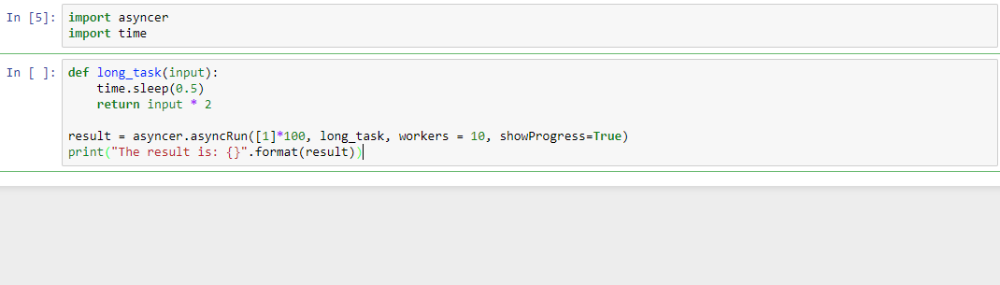

# Asyncer
Python Asynchronous Function Execution using AscyncIO. Concurrent execution of lengthy IO bound computations such as webscraping and API testing. Compatible with both Jupyter Notebooks and command line Python programs.



## Install
```
pip install git+git://github.com/M-Anwar/Asyncer.git#egg=asyncer
```

## Usage
Asyncer exposes one main function `asyncRun`. This function takes an iterable of data, a function to run for each element and optional arguments.

```python
def asyncRun(data, function, workers=10, showProgress=False):
    """
    param data: [Iterable]     -> Iterable of tuples, which are arguments to your function
    param function: [Function] -> The function to execute for each element in data 
                                  (should accept the same number of parameters as the length of 
                                  each tuple in data )
    param workers: [Integer]   -> [DEFAULT 10] The number of worker threads to use 
    param showProgress: [Bool] -> [DAFAULT False] To show progress or not (requires tqdm)
    return: [List]             -> A list of return values from running function on each element of data.
    """
```

## Examples

### Simple Example
Below is a simple program showing the use of `asyncRun`

```Python
import asyncer
import time

def long_task(input):
    time.sleep(0.5)
    return input * 2

result = asyncer.asyncRun([1]*100, long_task, workers = 10, showProgress=True)
print("The result is: {}".format(result))
```

### Webscraping Example
Below is a more advanced use case for `asyncRun`,